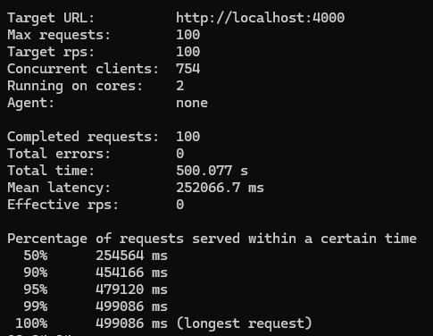
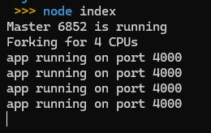
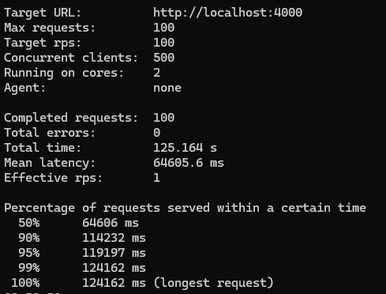

# The internals of `Node`
## Are `Node` is single thread?
not truly, but it is single thread in the sense that it has only one thread per process.

### Example
```js
const crypto = require('crypto')

const start = Date.now()

crypto.pbkdf2('a', 'b', 100000, 512, 'sha512', () => {
    console.log('1:', Date.now() - start);
})
```
This is a simple example of `Node` code that makes use of the `crypto` module to hash a string.

when we run this code, it will take some time to execute, and then it will print out the time it took to execute the function. 

till this moment doesn't seem to be anything special, but if we run the same function again, we will see that it will take the same amount of time to execute the function. 

```js
const crypto = require('crypto')

const start = Date.now()

crypto.pbkdf2('a', 'b', 100000, 512, 'sha512', () => {
    console.log('1:', Date.now() - start);
})

crypto.pbkdf2('a', 'b', 100000, 512, 'sha512', () => {
    console.log('2:', Date.now() - start);
})
```
now we will see the two functions will take the same amount of time to execute, and this is because the **thread pool**.

### Thread pool
thread pool is a set of threads that are available to execute tasks.

### Another example
```js
const crypto = require('crypto')


const start = Date.now()

crypto.pbkdf2('a', 'b', 100000, 512, 'sha512', () => {
    console.log('1:', Date.now() - start);
})

crypto.pbkdf2('a', 'b', 100000, 512, 'sha512', () => {
    console.log('2:', Date.now() - start);
})

crypto.pbkdf2('a', 'b', 100000, 512, 'sha512', () => {
    console.log('3:', Date.now() - start);
})

crypto.pbkdf2('a', 'b', 100000, 512, 'sha512', () => {
    console.log('4:', Date.now() - start);
})

crypto.pbkdf2('a', 'b', 100000, 512, 'sha512', () => {
    console.log('5:', Date.now() - start);
})
```

when we run this code, we will see that the first four functions will take the same amount of time to execute, and the fifth function will take a little bit longer to execute.

this is because the thread pool has only four threads by default, and the fifth function will wait for one of the threads to be available to execute it.

### Conclusion

when we run the code, `Node` will start up a thread pool with four threads by default, and these threads are available to execute code inside of our `Node` application.

when we call `crypto.pbkdf2` function, it will take the function and pass it off to one of the threads in the thread pool, and that thread will then execute the function.

when the function is done executing, it will then pass the result back to the `Node` event loop, and then `Node` will call the callback function that we passed to `crypto.pbkdf2` function.

### Changing the thread pool size
we can change the size of the thread pool by using `process.env.UV_THREADPOOL_SIZE` environment variable.

```js
process.env.UV_THREADPOOL_SIZE = 2
```
if use windows, we can use `set` command to set the environment variable when we run the code.

```bash 
set UV_THREADPOOL_SIZE=2 && node <filename>.js
```

now we will see that the first two functions will take the same amount of time to execute, and the third function will wait for one of the threads to be available to execute it.


### Libuv OS Delegation
`Node` uses `libuv` to handle the thread pool, and `libuv` uses `OS` delegation to handle the thread pool.

`OS` delegation means that `libuv` will delegate the task of creating threads to the `OS`.

### Example
```js
const https = require('https');

const start = Date.now();

const doRequest = () => {
    https.request('https://www.google.com', res => {
        res.on('data', () => {})
    
        res.on('end', () => {
            console.log('time', Date.now() - start);
        })
    }).end()
}

doRequest()
doRequest()
doRequest()
doRequest()
doRequest()
doRequest()
```
when we run this code, we will see all the requests will take the same amount of time to execute.

### Conclusion
OS delegation means that `libuv` will delegate the task of creating threads to the `OS`, and the `OS` will decide how many threads to create and this tasks not related to the thread pool.

### Multitask in Node
#### Example
```js
const https = require('https');
const crypto = require('crypto');
const fs = require('fs');

const start = Date.now();

const doRequest = () => {
    https.request('https://www.google.com', res => {
        res.on('data', () => {})
    
        res.on('end', () => {
            console.log('request: ', Date.now() - start);
        })
    }).end()
}

const doHash = () => {
    crypto.pbkdf2('a', 'b', 100000, 512, 'sha512', () => {
        console.log('Hash:', Date.now() - start);
    })
}

doRequest();

fs.readFile('multitask.js', 'utf-8', () => {
    console.log('Fs:', Date.now() - start);
});


doHash()
doHash()
doHash()
doHash()
```
when we run this code, we will see first request execute, then one of hashing tasks, then the file system task, and then the hashing tasks.

# Node Performance

## Clustering in Node
### What is clustering?
clustering is a way to take a single instance of `Node` and duplicate it, and have all of these instances of `Node` running simultaneously.

## Example
```js
const express = require('express');

const app = express();
const doWork = (duration) => {
    const start = Date.now();
    while (Date.now() - start < duration) {}
}

app.get('/', (req, res) => {
    doWork(5000);
    res.status(200).send('Hi')
} )

app.listen(4000, () => {
    console.log('app running on port 4000');
})
```
This code will take 5 seconds to execute the `doWork` function, and then it will send the response. if in this time we send another request, it will wait for the first request to finish, and then it will execute the second request.

**look benchmark without clustering for 100 requests**:



```js
const cluster = require('cluster');
const os = require('os');
const express = require('express');


if (cluster.isMaster) {
    console.log(`Master ${process.pid} is running`);
    const cpuCount = os.cpus().length;
    console.log(`Forking for ${cpuCount} CPUs`);
    for (let i = 0; i < cpuCount; i++) {
        cluster.fork();
    }    
} else {
    
    const app = express();
    const doWork = (duration) => {
        const start = Date.now();
        while (Date.now() - start < duration) {}
    }

    app.get('/', (req, res) => {
        doWork(5000);
        res.status(200).send('Hi')
    } )

    app.get('/fast', (req, res) => {
        res.status(200).send('Fast')
    })

    app.listen(4000, () => {
        console.log('app running on port 4000');
    })
}
```
when we run this code, we will see that the master process will fork four workers, and each worker will execute the code inside the else block.

now if we send a request to the `/` route, it will take 5 seconds to execute the `doWork` function, and then it will send the response. if in this time we send another request, it will be handled by another worker, and it will send the response immediately.

**look benchmark with clustering for 100 requests and node instances**:

 

## PM2 CLI
### What is PM2?
`PM2` is a production process manager for Node.js applications with a built-in load balancer. It allows you to keep applications alive forever, to reload them without downtime and to facilitate common system admin tasks. It is a cluster manager, and it will handle the clustering for us. [PM2](https://pm2.keymetrics.io/) [Github](https://github.com/Unitech/pm2)

### How to use PM2?
we can install `PM2` globally by using the following command:

```bash
npm install pm2 -g
```

now we can run our code by using `PM2` by using the following command:

```bash
pm2 start <filename>.js -i 0
```
`-i` flag means that we want to run as many instances as we have CPU cores.

now we can see the status of our instances by using the following command:

```bash
pm2 list
```

we can monitor all instances by using the following command:

```bash
pm2 monit
```

we can stop all instances by using the following command:

```bash
pm2 delete <app name>
```
